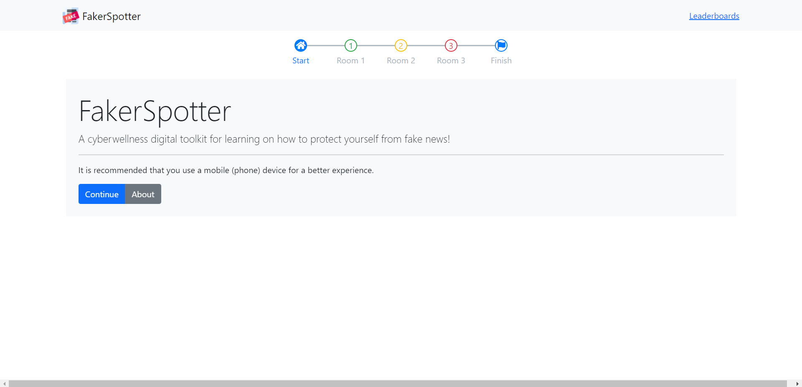
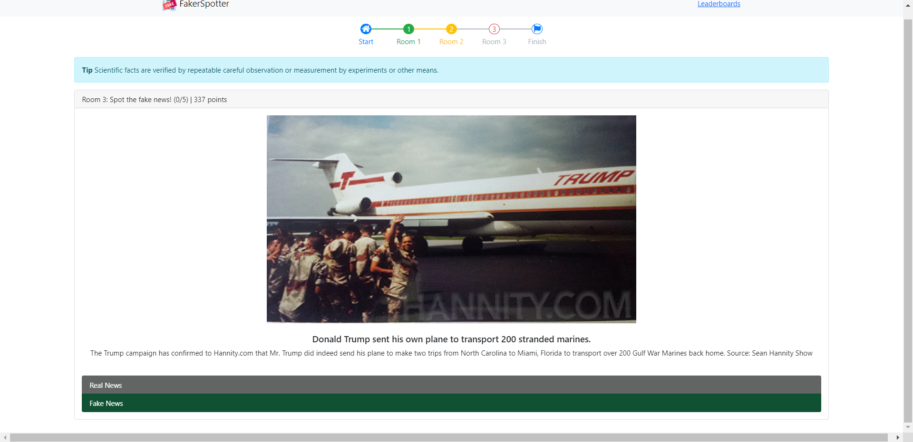
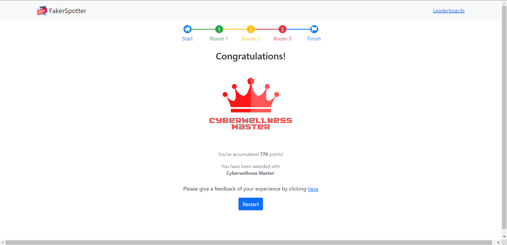

#  FakerSpotter

A cyberwellness digital toolkit for learning on how to protect yourself from fake news!

We teach players by making them learn from their mistakes and through trial-and-error. The leaderboards was added in order to incite the players with the feeling of competivitiveness and motivation. This project is also participating in the National Cyberwellness Advocacy Challenge (NCAC).

## Usage

The player needs to answer all questions correctly in order to proceed to the next room. If one answered a question incorrectly, the game will deduct a small amount of points depending on the difficulty of the room and the player will need to retry again until the amount of the room points left is under 100.

### Escape Rooms

* **Room 1**: Is it a fact or a opinion? (max 300 points/10 questions)
* **Room 2**: Spot the fake headline! (max 200 points/5 questions)
* **Room 3**: Spot the fake news! (max 500 points/5 questions)

### End Awards

* **Cyberwellness Champion**: 800-1000 points 👑
* **Cyberwellness Master**: 600-800 points ⚔
* **Cyberwellness Apprentice**: 400-600 points 💁‍♂️
* **Cyberwellness Novice**: 0-400 points 🤔

## Screenshots

